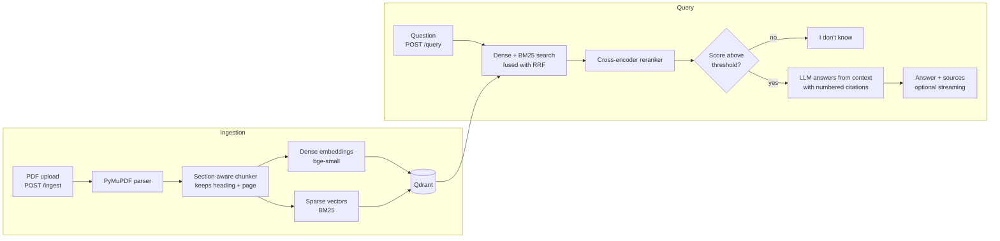

# GeoDocs Assistant

A citation-grounded RAG assistant for geospatial and disaster-risk reports. Ask a question, get an answer with page-level citations, or an honest "I don't know" when the documents don't support one.

**Live demo:** _add link_ · **Demo video (2 min):** _add link_ · **Build walkthrough:** _add YouTube link_

## Why this project

Most RAG demos are "chat with a PDF". This one is built to be measured and trusted:

- **Answers cite their sources** (file, page, section heading).
- **It refuses when the evidence is weak**, both by a retrieval score cutoff and by a prompt rule.
- **Retrieval is evaluated**, not assumed: dense vs hybrid vs hybrid + rerank on a labelled question set.

## Architecture



## Stack

| Layer | Choice |
|---|---|
| API | FastAPI (`/ingest`, `/query`, `/places`, `/health`, SSE streaming) |
| Parsing | PyMuPDF, heading detection by font size |
| Embeddings | `BAAI/bge-small-en-v1.5` (dense), Qdrant BM25 via fastembed (sparse) |
| Vector DB | Qdrant, hybrid search with Reciprocal Rank Fusion |
| Reranker | `cross-encoder/ms-marco-MiniLM-L-6-v2` |
| LLM | Claude via a thin provider layer (`app/llm/provider.py`) |
| Ops | Docker, docker-compose, GitHub Actions (ruff, pytest, docker build) |

## Quick start

```bash
cp .env.example .env            # add ANTHROPIC_API_KEY
docker compose up --build       # app on :8000, Qdrant on :6333
```

Ingest a document and ask a question:

```bash
curl -F "file=@data/report.pdf" localhost:8000/ingest

curl -X POST localhost:8000/query \
  -H "Content-Type: application/json" \
  -d '{"question": "What return period does the flood map use?", "mode": "hybrid_rerank"}'
```

A small web UI (question box, sources, map) is served at `localhost:8000`. Interactive API docs are at `localhost:8000/docs`. Retrieval modes: `dense`, `hybrid`, `hybrid_rerank` (default).

Local development without Docker:

```bash
pip install -r requirements.txt -r requirements-dev.txt
docker compose up -d qdrant
uvicorn app.main:app --reload
pytest -q
```

## Map view

After each answer, an LLM extracts the place names it mentions and `POST /places` geocodes them with OpenStreetMap's Nominatim; the UI plots them on a Leaflet map. Place names (not your documents) are sent to Nominatim, which limits usage to about one request per second, so lookups are throttled and cached in memory.

## Evaluation

`eval/run_eval.py` runs each retrieval mode over a labelled Q&A set and reports:

- **hit@k / MRR:** was the correct source and page retrieved, and how high?
- **Faithfulness:** is each answer supported by its retrieved context (LLM judge)?
- **Correct / false refusals:** does it decline unanswerable questions without declining answerable ones?

_Paste the table from `eval/results.md` here after running it:_

| mode | hit@5 | MRR | faithfulness | correct refusals | false refusals | retrieval ms |
|---|---|---|---|---|---|---|
| dense | | | | | | |
| hybrid | | | | | | |
| hybrid_rerank | | | | | | |

Setup: _N_ questions over _N_ documents (_M_ deliberately unanswerable).

**Limitations of this eval:** the faithfulness judge is an LLM, so it approximates rather than proves correctness. Part of the question set was drafted from document chunks and then hand-reviewed, which can favour lexical matching.

## Design decisions

- **Hybrid search:** BM25 catches exact terms (place names, standard numbers, acronyms) that embeddings blur.
- **Refusal thresholds depend on the mode**, because cosine, RRF, and cross-encoder scores are not comparable.
- **Provider layer:** swapping the LLM means changing one file.
- **Section-aware chunking:** headings travel with each chunk so citations point to meaningful sections.

## Known limitations

- PDFs only; scanned documents would need OCR.
- Heading detection is heuristic (font size and weight) and may misfire on unusual layouts.
- Refusal thresholds need tuning per document collection.

## Roadmap

- [x] Extract place names from answers and show them on a map
- [ ] Support more file types
- [ ] Per-document filtering in queries

## Project layout

```
app/        FastAPI app, ingestion, retrieval, LLM layer
eval/       question generation and evaluation scripts
tests/      pytest suite
```

Built by Techsparrow.
